# DupChat

`DupChat` is a prototype for simple secured messenger. I learn how to
create [Progressive Web Applications](https://developer.mozilla.org/en-US/docs/Web/Progressive_web_apps) and made this
`DupChat` app to test some techniques: database connectivity (relational and indexed DB), back-to-front
messaging ([SSE](https://en.wikipedia.org/wiki/Server-sent_events)),
encryption ([NaCl](https://en.wikipedia.org/wiki/NaCl_(software))), UI composition (Vue 3 and Quasar UI ), event driven
architecture, etc. One only programming language has been used to create this app - vanilla JavaScript (ES6+).

This is a simple person-to-person chat engine that uses asymmetric encryption. Everyone can start own chat server and
communicate with other people using text messages. The first user can be registered on the server without any
restrictions, just open front part of this app. All other people must have invitation link from any existing user to
join. You don't need to type any identification information (email or phone number) to register you smartphone or
notebook as a chat client. All messages are encrypted on the front ends before sending, server cannot decrypt chat
messages.

This is just a PWA features test, not a full-featured application, please, don't expect too much. `DupChat` works with
text messages only for now (no attachments, images, voice messages, etc.)

Invitation link to demo: https://dup.flancer64.com/#/invite/validate/b710ab0be296292cff604cfdb6c14d9e

QR-code for smartphones:


* [Requirements](#requirements)
* [Installation](#installation)
* [Logs monitoring](#logs-monitoring)
* [First user registration](#first-user-registration)
* ['Homepage' panel](#homepage-panel)
* ['Configuration' panel](#configuration-panel)
* ['Add contact' panel](#add-contact-panel)
* [Create invitation link](#create-invitation-link)
* [Use invitation link](#use-invitation-link)
* [Conversations](#conversations)
* [Message chat](#message-chat)
* [Resume](#resume)

## Requirements

* Node.js engine.
* Package manager (`npm` or `yarn`).
* Backend RDBMS (Postgres, MySQL, MariaDB).
* Chrome browser or other PWA aware software.

## Installation

### Clone and install

```shell
$ git clone --depth 1 --branch 0.1.0  https://github.com/flancer32/dup-proto.git
$ cd dup-proto/
$ npm install
```

### Create local config

```shell
$ cp ./cfg/init.json ./cfg/local.json
$ nano ./cfg/local.json
```

### Create DB for backend

`DupChat` uses `knex` package to work with data on backend. Any of these three RDBMS can be used on backend (
see [more](./doc/rdb_setup.md)):

* SQLite (file & in-memory)
* MySQL/MariaDB
* PostgreSQL

This is configuration options for `./cfg/local.json` file to use SQLite in-memory DB:

```json
{
  "@flancer32/dup-proto": {
    "db": {
      "client": "sqlite3",
      "connection": {
        "filename": ":memory:"
      },
      "useNullAsDefault": true
    }
  }
}
```

### Setup local config

Change local configuration according your environment:

```json
{
  "@flancer32/dup-proto": {
    "db": {
      "use": "'knex' configuration options here"
    },
    "logsMonitor": "dup.log.flancer64.com"
  },
  "@teqfw/core": {
    "devMode": false
  },
  "@teqfw/web": {
    "frontLogsMonitoring": true,
    "server": {
      "port": 9999
    },
    "urlBase": "[localhost|dup.flancer64.com]"
  },
  "@teqfw/web-push": {
    "email": "dup@flancer64.com"
  }
}
```

* **@flancer32/dup-proto**:
  * **db**: `knex` based configuration for DB connection on backend;
  * **logsMonitor**: (optional) address of log monitoring service (
    see [flancer64/pwa_log_agg](https://github.com/flancer64/pwa_log_agg));
* **@teqfw/core**:
  * **devMode**: `true` if application started in development mode (remove `i18n` cache, etc.);
* **@teqfw/web**:
  * **frontLogsMonitoring**: `true` if fronts should use log transmitting to back by default;
  * **server**:
    * **port**: port to use by application's web server;
  * **urlBase**: `localhost` or any domain name that is used to connect to web-server;
* **@teqfw/web-push**:
  * **email**: used by [web-push](https://github.com/web-push-libs/web-push) package as admin contact to prepare Web
    Push requests;

### Test backend

```shell
$ ./bin/tequila.mjs help
03/07 16:03:08.665 (info): Backend application UUID: a948d6a6-a843-4c6e-bc2f-d69dad8b751a.
  03/07 16:03:08.891 (info): Setup connection to DB 'dup@127.0.0.1' as 'dup'.
Usage: tequila [options] [command]

Options:
  -h, --help                  display help for command

Commands:
  app-db-init [options]       (Re)create RDB structure and fill it with test data (on demand).
  core-version                get version of the application.
  web-crypto-keys-create      Create new server keys for asynchronous encryption.
  web-server-start [options]  start web server
  web-server-stop             stop web server
  web-push-send [options]     Send push notification to the user.
  web-push-key-create         Create new server keys for Web Push API.
  help [command]              display help for command
```

### Initialize backend DB

Backend DB tables will be created on the first launch:

```shell
03/07 16:12:00.731 (info): Backend application UUID: c7f185e0-893f-4320-8b04-d699804f0041.
03/07 16:12:00.936 (info): Setup connection to DB 'dup@127.0.0.1' as 'dup'.
03/07 16:12:01.053 (info): Total 6 entities are in DEM.
03/07 16:12:01.054 (info): Table 'app_cfg' is created.
03/07 16:12:01.054 (info): Table 'web_front' is created.
03/07 16:12:01.054 (info): Table 'app_user_invite' is created.
03/07 16:12:01.054 (info): Table 'app_user_tree' is created.
03/07 16:12:01.054 (info): Table 'web_event_queue' is created.
03/07 16:12:01.054 (info): Table 'web_push_subscript' is created.
03/07 16:12:01.370 (info): Database structure is recreated.
03/07 16:12:01.471 (info): Connections to 'dup@127.0.0.1' as 'dup' are closed.
```

This is schema for backend DB:

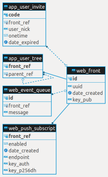

You can re-initialize DB schema manually (except in-memory DB):

```shell
$ ./bin/tequila.mjs app-db-init
```

### Start backend server in HTTP/1 mode

HTTP/1 mode is used for development (`localhost:9999`).

```shell
$ ./bin/tequila.mjs web-server-start -1
03/07 16:15:27.749 (info): Backend application UUID: cbd09021-2fd6-4fe2-9955-bd53bb80eefb.
03/07 16:15:27.953 (info): Setup connection to DB 'dup@127.0.0.1' as 'dup'.
03/07 16:15:27.695 (info): Teq-application is started in '/.../dup-proto' (ver. 0.1.0).
...
03/07 16:15:28.085 (info): Web server is started on port 9999 in HTTP/1 mode.
```

Open link `http://localhost:9999/` in your browser:

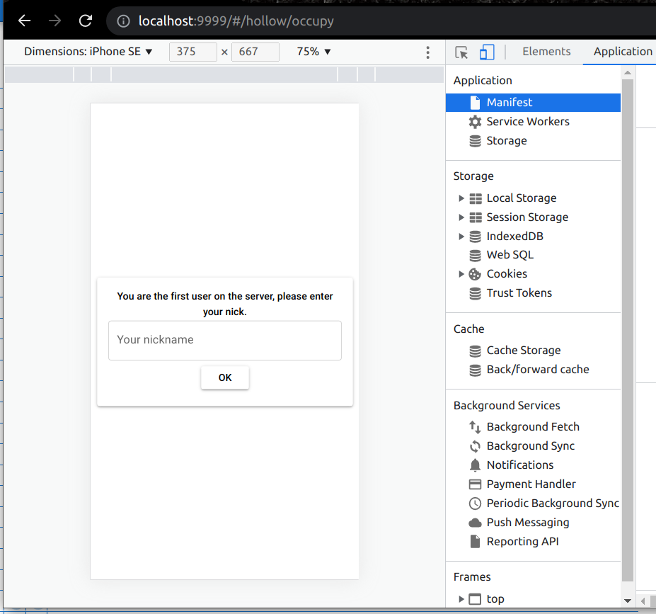

### Setup reverse proxy

I use Apache 2 server as reverse proxy to handle HTTPS traffic. Backend application for `DupChat` is started in HTTP/2
mode in this case.

Apache config:

```apacheconf
<VirtualHost *:80>
    ServerName dup.flancer64.com
    RewriteEngine on
    RewriteRule ^ https://%{SERVER_NAME}%{REQUEST_URI} [END,NE,R=permanent]
</VirtualHost>

<VirtualHost *:443>
    ServerName dup.flancer64.com
    Header set Access-Control-Allow-Origin "*"
    SSLCertificateFile /etc/letsencrypt/live/dup.flancer64.com/fullchain.pem
    SSLCertificateKeyFile /etc/letsencrypt/live/dup.flancer64.com/privkey.pem
    Include /etc/letsencrypt/options-ssl-apache.conf
    # Redirect all requests to HTTP2 server.
    RewriteEngine  on
    RewriteRule    "^/(.*)$"  "h2c://localhost:9999/$1"  [P]
</VirtualHost>
```

Start backend in HTTP/2 mode:

```shell
$ ./bin/tequila.mjs web-server-start
```

## Logs monitoring

This project uses log monitoring service: [flancer64/pwa_log_agg](https://github.com/flancer64/pwa_log_agg)
. `pwa_log_agg` is a standalone project created on the same platform.

You can see backend and frontend logs at https://dup.log.flancer64.com/#/ . All fronts transmit own logs to back then
back transmits its to this monitoring service. Logs transmitting can be disabled in [app config](#configuration-panel).

## First user registration

Goto frontend then enter your nickname:

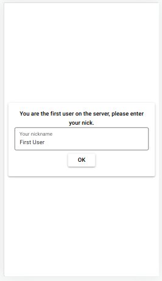

That's all.

## 'Homepage' panel

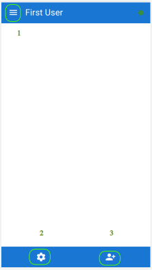

1. Goto home
2. Open configuration panel
3. Add contact

## 'Configuration' panel

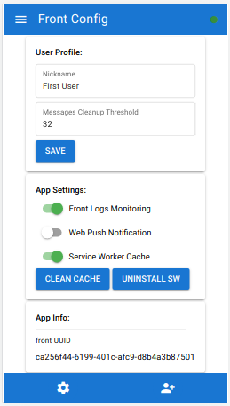

* **User Profile**
  * **Nickname**: your own nickname in this front app.
  * **Messages Cleanup Threshold**: number of messages to store in IDB for one band (person-to-person chat).
* **App Settings**
  * **Front Logs Monitoring**: enable/disable logs transmitting to backend for this front.
  * **Web Push Notification**: enable/disable Web Push notifications for this front.
  * **Service Worker Cache**: don't use Service Worker cache (helpful for developers).
  * **Clean Cache**: remove all files saved in Service Worker cache.
  * **Uninstall SW**: uninstall current Service Worker (for developers).
* **App Info**:
  * **front UUID**: UUID for current front (all front's logs are marked with this UUID).

User profile and all other frontend data are stored in IndexedDBs:


## 'Add contact' panel

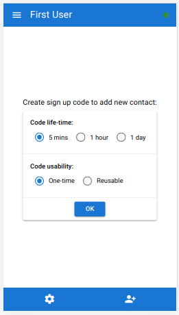

This panel allows inviting new users to the chat or establishing connection with existing user.

## Create invitation link

Invitation link can be one-time or reusable and has an expiration time (5 minutes, 1 hour or 1 day) - see above. This is
generation result for desktop/notebooks:

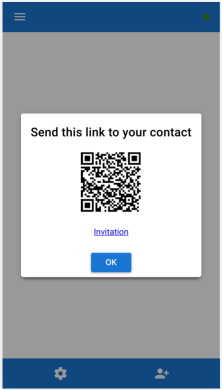

... and for smartphones:

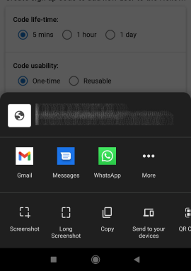

You can send invitation link using any available communication channel (email, messenger, etc.) or generate QR-code to
pass this invitation link to another party.

## Use invitation link

This is typical invitation link: https://.../#/invite/validate/f8d30ab409fb50a1e47ac540293f64c3

... and the first step of registration process:

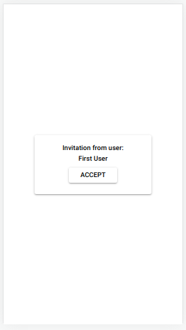

Press 'Accept' button then enter your nickname:

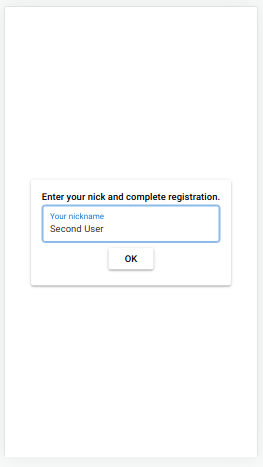

This nickname is used as your default contact name for other users.

## Conversations

Home panel displays all available contacts and conversations:

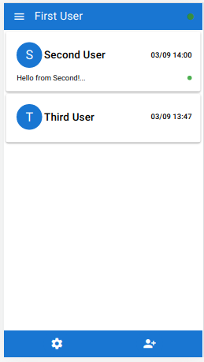

### Conversation card

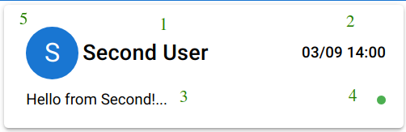

1. Contact name (local).
2. Date-time of the last communication.
3. Part of the last message (incoming or outgoing).
4. Unread led. Indicates that message is not read by recipient.
5. Icon with the first letter of contact name allows editing contact name locally.

### Contact card

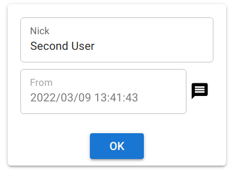

1. **Nick**: local name for contact.
2. **From**: date-time when contact was added to local address book.
3. **Message icon**: go to conversation with this contact.

## Message chat

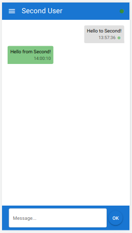

Only text messages are allowed in the chat for now.

LED indicator states for outgoing messages (on the right side):

* **grey**: message is not sent to the server yet (sender's smartphone is offline).
* **yellow**: message is sent to the server but is not transferred to recipient (recipient's smartphone is offline).
* **blue**: message is transferred to recipient but is not read yet.
* **green**: message is read by recipient.

## Resume

I believe that Progressive Web Applications have a great perspectives, and I want to improve my own skills in this
technology. I am open to any contacts and suggestions in this area. `DupChat` is just a demo of the possibilities of
what PWA is capable of.

My contacts:
* **email**: alex@flancer32.com
* **skype**: alex.gusev.work
* **telegram**: @wiredgeese
