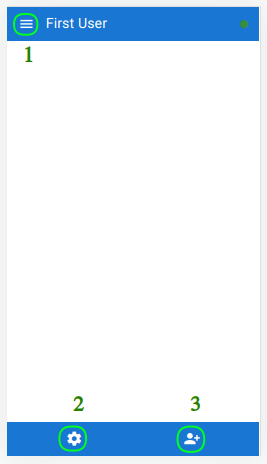
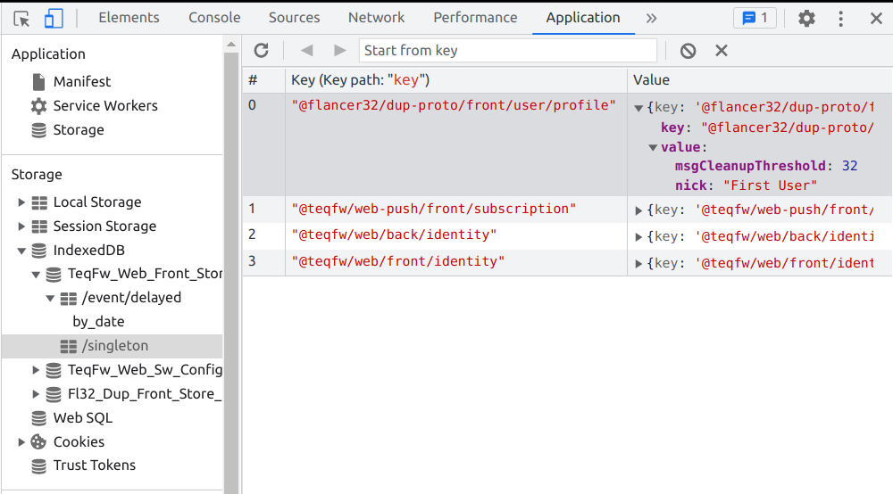
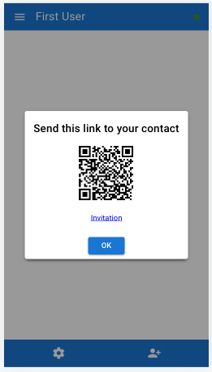

# DupChat

`DupChat` is a prototype for simple secured messenger. I learn how to
create [Progressive Web Applications](https://developer.mozilla.org/en-US/docs/Web/Progressive_web_apps) and made this
`DupChat` app to test some techniques: database connectivity (relational and indexed DB), back-to-front
messaging ([SSE](https://en.wikipedia.org/wiki/Server-sent_events)),
encryption ([NaCl](https://en.wikipedia.org/wiki/NaCl_(software))), UI composition (Vue 3 and Quasar UI ), event driven
architecture, etc. One only programming language has been used to create this app - vanilla JavaScript (ES6+).

This is a simple person-to-person chat engine that uses asymmetric encryption. Everyone can start own chat server and
communicate with other people using text messages. The first user can be registered on the server without any
restrictions, just open front part of this app. All other people must have invitation link from any existing user to
join. You don't need to type any identification information (email or phone number) to register you smartphone or
notebook as a chat client. All messages are encrypted on the front ends before sending, server cannot decrypt chat
messages.

This is just a PWA features test, not a full-featured application, please, don't expect too much. `DupChat` works with
text messages only for now (no attachments, images, voice messages, etc.)

* [Requirements](#requirements)
* [Installation](#installation)
* [First user registration](#first-user-registration)
* 'Homepage' panel
* 'Configuration' panel
* 'Add contact' panel
* Create invitation link

## Requirements

* Node.js engine.
* Package manager (`npm` or `yarn`).
* Backend RDBMS (Postgres, MySQL, MariaDB).
* Chrome browser or other PWA aware software.

## Installation

### Clone and install

```shell
$ git clone https://github.com/flancer32/dup-proto.git
$ cd dup-proto/
$ npm install
```

### Create DB for backend

```shell
$ sudo mysql
...
> CREATE DATABASE dup;
> CREATE USER dup@localhost IDENTIFIED BY '...';
> GRANT ALL PRIVILEGES ON dup.* TO dup@localhost;
> FLUSH PRIVILEGES;
```

### Create local config

```shell
$ cp ./cfg/init.json ./cfg/local.json
$ nano ./cfg/local.json
```

Change local configuration according your environment:

```json
{
  "@flancer32/dup-proto": {
    "db": {
      "client": "mysql2|pg",
      "connection": {
        "database": "dup",
        "host": "127.0.0.1",
        "password": "...",
        "user": "dup"
      }
    }
  },
  "@teqfw/core": {
    "devMode": false
  },
  "@teqfw/web": {
    "server": {
      "port": 9999
    },
    "urlBase": "localhost" // or domain name: dup.flancer64.com
  },
  "@teqfw/web-push": {
    "email": "dup@flancer64.com"
  }
}

```

### Test backend

```shell
$ ./bin/tequila.mjs help
03/07 16:03:08.665 (info): Backend application UUID: a948d6a6-a843-4c6e-bc2f-d69dad8b751a.
  03/07 16:03:08.891 (info): Setup connection to DB 'dup@127.0.0.1' as 'dup'.
Usage: tequila [options] [command]

Options:
  -h, --help                  display help for command

Commands:
  app-db-init [options]       (Re)create RDB structure and fill it with test data (on demand).
  core-version                get version of the application.
  web-crypto-keys-create      Create new server keys for asynchronous encryption.
  web-server-start [options]  start web server
  web-server-stop             stop web server
  web-push-send [options]     Send push notification to the user.
  web-push-key-create         Create new server keys for Web Push API.
  help [command]              display help for command
```

### Initialize backend DB

```shell
$ ./bin/tequila.mjs app-db-init
03/07 16:12:00.731 (info): Backend application UUID: c7f185e0-893f-4320-8b04-d699804f0041.
03/07 16:12:00.936 (info): Setup connection to DB 'dup@127.0.0.1' as 'dup'.
03/07 16:12:01.053 (info): Total 6 entities are in DEM.
03/07 16:12:01.054 (info): Table 'app_cfg' is created.
03/07 16:12:01.054 (info): Table 'web_front' is created.
03/07 16:12:01.054 (info): Table 'app_user_invite' is created.
03/07 16:12:01.054 (info): Table 'app_user_tree' is created.
03/07 16:12:01.054 (info): Table 'web_event_queue' is created.
03/07 16:12:01.054 (info): Table 'web_push_subscript' is created.
03/07 16:12:01.370 (info): Database structure is recreated.
03/07 16:12:01.471 (info): Connections to 'dup@127.0.0.1' as 'dup' are closed.
```

This is schema for backend DB:


### Start backend server in HTTP/1 mode

HTTP/1 mode is used for development (`localhost:9999`).

```shell
$ ./bin/tequila.mjs web-server-start -1
03/07 16:15:27.749 (info): Backend application UUID: cbd09021-2fd6-4fe2-9955-bd53bb80eefb.
03/07 16:15:27.953 (info): Setup connection to DB 'dup@127.0.0.1' as 'dup'.
03/07 16:15:27.695 (info): Teq-application is started in '/.../dup-proto' (ver. 0.1.0).
...
03/07 16:15:28.085 (info): Web server is started on port 9999 in HTTP/1 mode.
```

Open link `http://localhost:9999/` in your browser:


### Setup reverse proxy

I use Apache 2 server as reverse proxy to handle HTTPS traffic. Backend application for `DupChat` is started in HTTP/2
mode in this case.

Apache config:

```apacheconf
<VirtualHost *:80>
    ServerName dup.flancer64.com
    RewriteEngine on
    RewriteRule ^ https://%{SERVER_NAME}%{REQUEST_URI} [END,NE,R=permanent]
</VirtualHost>

<VirtualHost *:443>
    ServerName dup.flancer64.com
    Header set Access-Control-Allow-Origin "*"
    SSLCertificateFile /etc/letsencrypt/live/dup.flancer64.com/fullchain.pem
    SSLCertificateKeyFile /etc/letsencrypt/live/dup.flancer64.com/privkey.pem
    Include /etc/letsencrypt/options-ssl-apache.conf
    # Redirect all requests to HTTP2 server.
    RewriteEngine  on
    RewriteRule    "^/(.*)$"  "h2c://localhost:9999/$1"  [P]
</VirtualHost>
```

Start backend in HTTP/2 mode:

```shell
$ ./bin/tequila.mjs web-server-start
```

## First user registration

Goto frontend then subscribe to Web Push notifications (if available):


Accept Web Push notification if it is blocked:


then enter your nickname:


That's all.

## 'Homepage' panel



1. Goto home
2. Open configuration panel
3. Add contact

## 'Configuration' panel


* **User Profile**
  * **Nickname**: your own nickname in this front app.
  * **Messages Cleanup Threshold**: number of messages to store in IDB for one band (person-to-person chat).
* **Service Worker Configuration**
  * **Clean**: remove all files saved in Service Worker cache.
  * **Disable**: don't use Service Worker cache (for developers).
  * **Uninstall**: uninstall current Service Worker (for developers).

User profile and all other frontend data are stored in IndexedDBs:



## 'Add contact' panel


This panel allows inviting new users to the chat or establishing connection with existing user.

## Create invitation link

Invitation link can be one-time or reusable and has an expiration time (5 minutes, 1 hour or 1 day) - see above. This is
generation result for desktop/notebooks:



... and for smartphones:


You can send invitation link using any available communication channel (email, messenger, etc.) or generate QR-code to
pass this invitation link to an other party.


